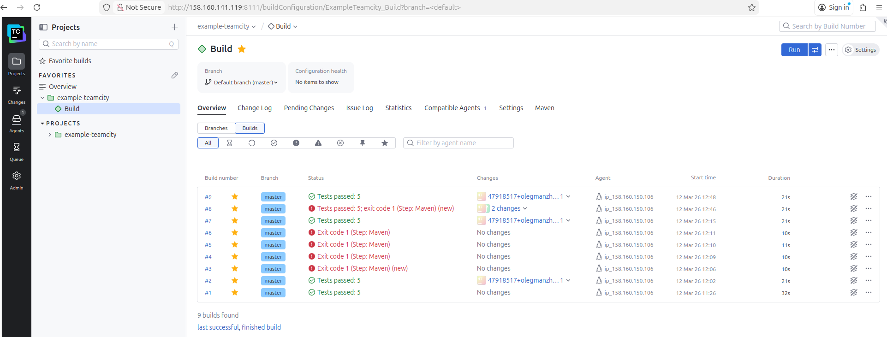

## Конфигурация teamcity

Learn Kotlin DSL
Portable

package _Self.buildTypes

import jetbrains.buildServer.configs.kotlin.*
import jetbrains.buildServer.configs.kotlin.buildFeatures.perfmon
import jetbrains.buildServer.configs.kotlin.buildSteps.maven

object Build : BuildType({
    name = "Build"

    vcs {
        root(HttpsGithubComOlegmanzhayExampleTeamcityGitRefsHeadsMaster)
    }

    steps {
        maven {
            id = "Maven2"

            conditions {
                contains("teamcity.build.branch", "master")
            }
            goals = "clean deploy"
            runnerArgs = "-Dmaven.test.failure.ignore=true"
            userSettingsSelection = "settings.xml"
        }
    }

    features {
        perfmon {
        }
    }
})

## ссылка на репо:
https://github.com/olegmanzhay/example-teamcity

